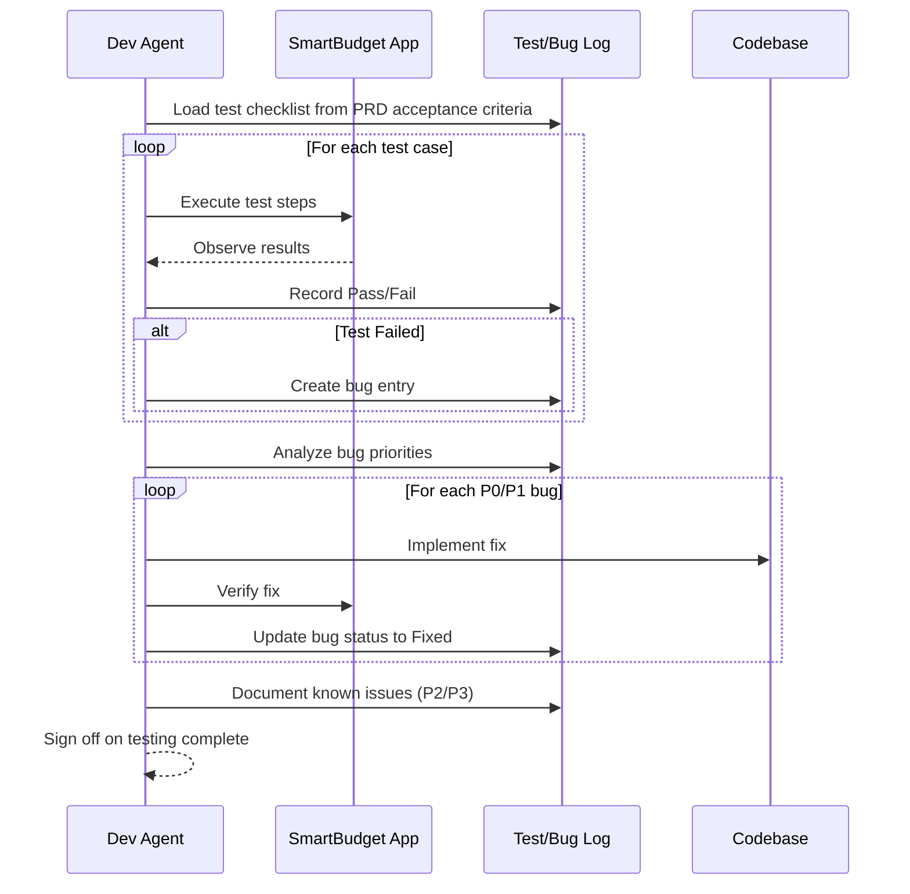
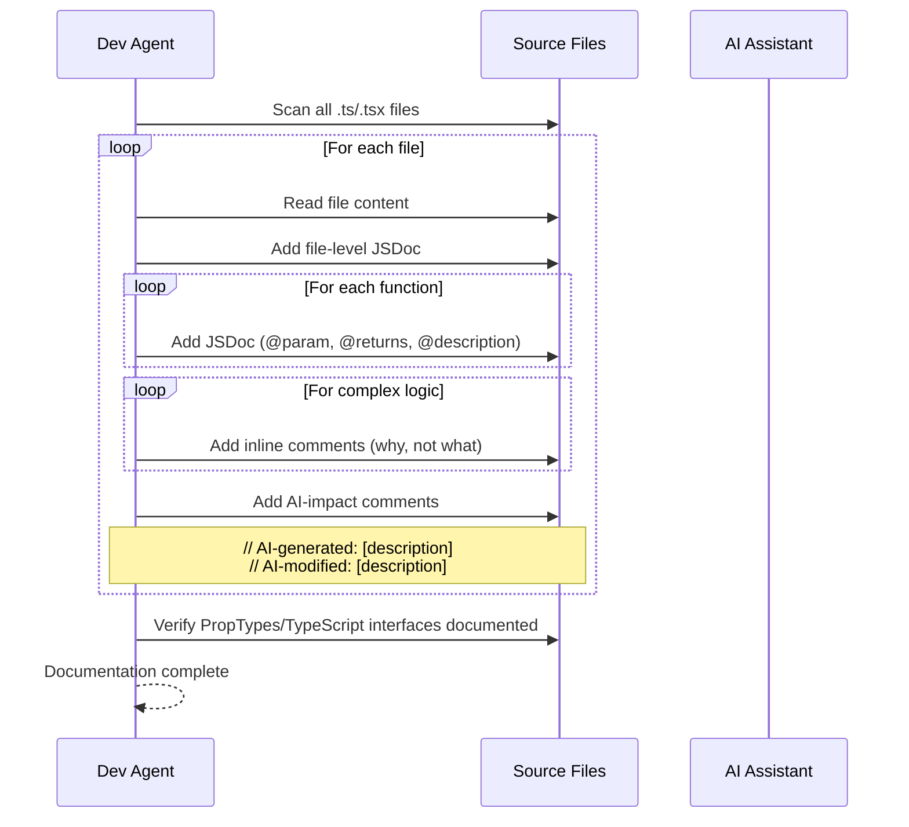
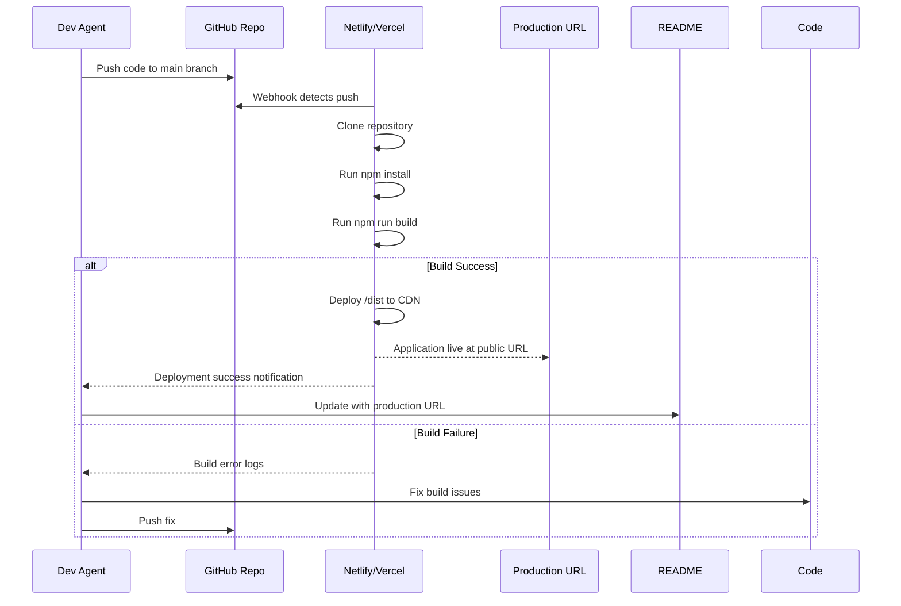

# Epic Technical Specification: Finalization and Deployment

Date: 2025-11-17
Author: Deyvid
Epic ID: 6
Status: Draft

---

## Overview

Epic 6 represents the final phase of the SmartBudget MVP delivery, focusing on quality assurance, comprehensive documentation, and production deployment. This epic transforms the implemented application from a development artifact into a production-ready, portfolio-quality project that demonstrates professional software development practices combined with AI-assisted development methodology.

The epic encompasses manual testing and bug resolution, code documentation with AI-impact tracking, comprehensive README creation, AI journey analysis through summary.md, production deployment to a public hosting platform, and final repository polish for professional presentation. This work directly supports the educational objectives outlined in the PRD by documenting the BMAD + AI-First development process.

## Objectives and Scope

**In Scope:**
- Comprehensive manual testing across all user flows and device types
- Critical (P0) and High (P1) bug fixes to ensure production readiness
- Complete code documentation with JSDoc comments and inline explanations
- AI-impact notation distinguishing AI-generated, AI-modified, and manual code
- Professional README.md with setup instructions, features, and deployment guide
- summary.md documenting AI-assisted development journey with quantifiable metrics
- Production deployment to Netlify or Vercel with public URL
- Final repository polish including Git history cleanup, licensing, and professional presentation

**Out of Scope:**
- Automated test suite development (deferred to post-MVP)
- Performance profiling beyond manual observation (NFR targets already met)
- Advanced CI/CD pipeline beyond basic automatic deploys
- Custom domain setup (optional enhancement)
- Analytics integration beyond basic hosting platform metrics
- User acceptance testing (MVP is demonstration project)
- Post-deployment monitoring tools (optional future enhancement)

## System Architecture Alignment

Epic 6 builds upon the complete Vite + React + TypeScript application developed in Epics 1-5. The architecture decisions documented in [architecture.md](../../docs/architecture.md) remain unchanged. This epic focuses on the quality assurance and deployment layers that sit outside the core application architecture.

**Key Architectural Touchpoints:**
- **Testing Strategy:** Manual testing validates the entire component hierarchy, state management flow, and LocalStorage persistence layer established in prior epics
- **Documentation:** JSDoc comments and inline documentation follow the naming conventions and code organization patterns defined in the architecture
- **Deployment:** Leverages Vite's optimized production build process configured in Epic 1, targeting static hosting platforms (Netlify/Vercel) as specified in architecture decisions
- **Repository Structure:** All documentation artifacts (README.md, summary.md, prompts.md) live at project root, maintaining the folder structure established in Epic 1

**Constraints:**
- No architectural changes allowed in this epic (application is feature-complete)
- Testing is manual only (no test framework dependencies added)
- Deployment must be static hosting compatible (no backend deployment complexity)
- Documentation follows existing code structure without refactoring

## Detailed Design

### Services and Modules

This epic does not introduce new application services or modules. Instead, it focuses on quality assurance and deployment workflows that operate on the existing codebase.

| Component | Responsibility | Inputs | Outputs | Owner |
|-----------|---------------|--------|---------|--------|
| **Testing Workflow** | Execute manual test plan covering all user flows | Test checklist, deployed application | Bug log, test results | Dev Agent |
| **Bug Fix Process** | Resolve identified defects | Bug log with priority ratings | Fixed code, updated tests | Dev Agent |
| **Documentation Generator** | Add JSDoc and inline comments to all code | Source code files (.tsx, .ts) | Documented code with AI-impact notes | Dev Agent |
| **README Author** | Create comprehensive project documentation | Project structure, setup steps, features | README.md | Dev/Tech Writer |
| **Summary Analyzer** | Document AI-assisted development impact | prompts.md, code artifacts, time logs | summary.md | Dev/PM |
| **Deployment Pipeline** | Build and deploy to production hosting | Source code, environment config | Public production URL | Dev Agent |
| **Repository Curator** | Polish Git history and repo presentation | Commit history, docs, license | Professional GitHub repo | Dev Agent |

**No new source code modules are created in this epic** - all work focuses on testing, documenting, and deploying existing code from Epics 1-5.

### Data Models and Contracts

**No new data models introduced.** This epic operates on existing data structures:
- Transaction model (from Epic 2)
- Category model (from Epic 2)
- Period model (from Epic 4)

**New Documentation Artifacts (non-code):**

```typescript
// Test Log Structure (markdown or CSV)
interface TestCase {
  id: string;                    // Test case identifier (e.g., "TC-001")
  feature: string;               // Feature being tested
  description: string;           // Test description
  steps: string[];               // Step-by-step instructions
  expectedResult: string;        // Expected outcome
  actualResult: string;          // Observed outcome
  status: 'Pass' | 'Fail' | 'Blocked';
  priority: 'P0' | 'P1' | 'P2';
  notes?: string;                // Additional observations
  bugId?: string;                // Reference to bug if failed
}

// Bug Log Structure
interface Bug {
  id: string;                    // Bug identifier (e.g., "BUG-001")
  title: string;                 // Short description
  description: string;           // Detailed description
  stepsToReproduce: string[];    // Reproduction steps
  severity: 'Critical' | 'High' | 'Medium' | 'Low';
  priority: 'P0' | 'P1' | 'P2' | 'P3';
  status: 'Open' | 'In Progress' | 'Fixed' | 'Deferred';
  affectedComponent: string;     // Component or file affected
  fixCommit?: string;            // Git commit SHA of fix
  testCaseId?: string;           // Reference to failed test case
}
```

### APIs and Interfaces

**Build & Deployment APIs:**

```bash
# Vite Build API (npm scripts)
npm run build
# Output: Optimized production bundle in /dist
# - Minified JavaScript
# - Purged CSS (Tailwind)
# - Hashed filenames for cache busting
# - Source maps

npm run preview
# Output: Local preview server of production build
# - Tests production build locally before deployment
```

**Netlify Deployment API:**

```toml
# netlify.toml (configuration contract)
[build]
  command = "npm run build"
  publish = "dist"

[[redirects]]
  from = "/*"
  to = "/index.html"
  status = 200  # SPA routing support
```

**Vercel Deployment API:**

```json
{
  "buildCommand": "npm run build",
  "outputDirectory": "dist",
  "framework": "vite",
  "rewrites": [
    { "source": "/(.*)", "destination": "/index.html" }
  ]
}
```

**Documentation Interfaces:**

```markdown
# README.md Structure (contract)
1. Project Title and Description
2. Features List
3. Screenshots/Demo
4. Technology Stack
5. Prerequisites
6. Installation Steps
7. Running Locally
8. Building for Production
9. Deployment
10. Project Structure
11. BMAD Methodology
12. AI-Assisted Development
13. License
14. Links to Related Docs

# summary.md Structure (contract)
1. Executive Summary
2. AI Tools and Configuration Used
3. Task-by-Task AI Impact Analysis
4. Code Generated vs. Modified vs. Manual
5. Time Impact and Efficiency Gains
6. Code Quality Impact
7. Challenges and Limitations
8. Lessons Learned
9. BMAD Methodology Reflections
10. Recommendations
```

### Workflows and Sequencing

**Story 6.1: Manual Testing & Bug Fixes Workflow**



**Story 6.2: Code Documentation Workflow**



**Story 6.5: Deployment Workflow**



**Testing Sequence (Detailed):**

1. **Setup Phase:** Ensure application runs locally, clear LocalStorage for clean state
2. **Functional Testing:** Execute all CRUD operations (add/edit/delete transactions)
3. **Dashboard Testing:** Verify calculations, charts render, period selector works
4. **Responsive Testing:** Test on 320px, 768px, 1024px, 1920px viewports
5. **Browser Testing:** Chrome, Firefox, Safari (latest versions)
6. **Edge Case Testing:** Empty state, single transaction, 100+ transactions
7. **Bug Documentation:** Record all issues with priority and repro steps
8. **Bug Fix Cycle:** Fix P0/P1 bugs, regression test, verify fixes
9. **Sign Off:** Confirm all critical acceptance criteria met

## Non-Functional Requirements

### Performance

**NFR-P1: Testing Execution Performance**
- Manual testing workflow should complete within 4-6 hours for full test coverage
- Individual test case execution time: <5 minutes per test
- Bug fix verification: <15 minutes per bug (excluding complex fixes)

**NFR-P2: Build Performance (Vite)**
- Production build completion: <60 seconds
- Development server startup: <2 seconds
- HMR updates during development: <100ms

**NFR-P3: Deployment Performance**
- Time from git push to production deployment: <5 minutes (Netlify/Vercel)
- First deployment setup (account creation, connection): <30 minutes

**NFR-P4: Application Performance Validation**
- Verify existing performance targets from PRD NFR-1 are met:
  - Initial page load: <3 seconds (3G connection)
  - UI responsiveness: <100ms for user actions
  - Chart rendering: <2 seconds
  - Filter updates: <500ms
- These should already be met from Epics 1-5, but must be verified in production

### Security

**NFR-S1: Documentation Security**
- No sensitive information (API keys, passwords) in any documentation files
- .env files must never be committed to repository
- .gitignore properly configured to exclude sensitive files

**NFR-S2: Deployment Security**
- HTTPS enforced on production URL (Netlify/Vercel provide this automatically)
- Environment variables securely configured in hosting platform (not in code)
- Source maps in production build (for debugging, no security risk for open-source project)

**NFR-S3: Repository Security**
- No hardcoded credentials or secrets in commit history
- LICENSE file clearly states project permissions (MIT recommended)
- Public repository intentionally public (open-source educational project)

**NFR-S4: Application Security Validation**
- Verify existing security measures from prior epics:
  - Input sanitization for transaction descriptions
  - Data validation on all user inputs
  - XSS prevention in rendered content
- No new security vulnerabilities introduced during testing/documentation

### Reliability/Availability

**NFR-R1: Production Uptime**
- Target: 99.9% uptime (dependent on hosting platform SLA)
- Netlify/Vercel provide high availability by default
- Static site architecture inherently reliable (no server downtime)

**NFR-R2: Build Reliability**
- Production build must be deterministic (same input = same output)
- Build process should never fail due to environment issues
- Automated deploys must succeed on first attempt (if tests pass locally)

**NFR-R3: Data Persistence Validation**
- LocalStorage reliability tested across multiple browser sessions
- Verify data survives browser close/reopen
- Confirm no data loss during normal operations
- Test storage quota handling (5MB limit)

**NFR-R4: Cross-Browser Reliability**
- Application must function identically across:
  - Chrome 90+ (primary)
  - Firefox 88+ (secondary)
  - Safari 14+ (secondary)
  - Mobile browsers (iOS Safari, Chrome Android)
- Zero critical bugs on any supported browser

### Observability

**NFR-O1: Build Observability**
- Vite build output provides clear success/failure indication
- Build errors include actionable error messages
- Production bundle size reported (should be <500KB for MVP)

**NFR-O2: Deployment Observability**
- Hosting platform (Netlify/Vercel) provides:
  - Deploy logs for troubleshooting
  - Deploy status (success/failure)
  - Deploy preview URLs for testing
  - Production URL with CDN metrics

**NFR-O3: Application Monitoring (Basic)**
- Browser console logging for debugging (development mode)
- Error boundaries catch React errors and display user-friendly messages
- No runtime errors in production console (verified during manual testing)

**NFR-O4: Documentation Observability**
- All documentation clearly versioned (date, author)
- README includes "Last Updated" timestamp
- Git history provides clear audit trail of all changes
- prompts.md provides complete timeline of AI interactions

## Dependencies and Integrations

### Existing Production Dependencies (No Changes)

Epic 6 does NOT add any new application dependencies. All dependencies from Epics 1-5 remain:

```json
{
  "dependencies": {
    "date-fns": "^4.1.0",           // Date manipulation (Epic 4)
    "lucide-react": "^0.553.0",     // Icon library (Epic 5)
    "react": "^18.3.1",             // Core framework (Epic 1)
    "react-dom": "^18.3.1",         // React DOM bindings (Epic 1)
    "react-router-dom": "^6.30.2",  // Client-side routing (Epic 1)
    "recharts": "^3.4.1",           // Chart library (Epic 4)
    "uuid": "^13.0.0"               // ID generation (Epic 2)
  }
}
```

### Development Dependencies (Already Installed)

All tooling needed for Epic 6 is already configured:

```json
{
  "devDependencies": {
    "eslint": "^9.39.1",                      // Linting (Epic 1)
    "prettier": "^3.6.2",                     // Code formatting (Epic 1)
    "husky": "^9.1.7",                        // Git hooks (Epic 1)
    "lint-staged": "^15.5.2",                 // Pre-commit linting (Epic 1)
    "typescript": "~5.9.3",                   // Type checking (Epic 1)
    "vite": "^6.4.1",                         // Build tool (Epic 1)
    "vitest": "^4.0.9",                       // Test framework (Epic 5)
    "@testing-library/react": "^16.3.0",      // Component testing (Epic 5)
    "@vitest/coverage-v8": "^4.0.9"           // Test coverage (Epic 5)
  }
}
```

**Note:** While testing infrastructure exists (Vitest, Testing Library), Story 6.1 uses MANUAL testing only. Automated tests are optional enhancements for Story 6.1.

### External Service Integrations

**Hosting Platform (Choose One):**

**Option A: Netlify**
- **Integration Point:** Git repository webhook
- **Authentication:** GitHub OAuth
- **Configuration:** `netlify.toml` (already exists in project root)
- **API:** Netlify Build API (automatic on git push)
- **Output:** Production URL (e.g., `https://smartbudget-[name].netlify.app`)

**Option B: Vercel**
- **Integration Point:** Git repository webhook
- **Authentication:** GitHub OAuth
- **Configuration:** `vercel.json` (create if choosing Vercel)
- **API:** Vercel Build API (automatic on git push)
- **Output:** Production URL (e.g., `https://smartbudget-[name].vercel.app`)

**Recommendation:** Netlify (already configured with `netlify.toml`)

### Integration Points

**Git → Hosting Platform:**
```
1. Developer: git push origin main
2. GitHub: Triggers webhook to Netlify/Vercel
3. Hosting: Clones repo, runs `npm install && npm run build`
4. Hosting: Deploys /dist folder to CDN
5. Hosting: Returns deployment URL and status
```

**Developer → GitHub:**
```
1. Commit with clear message
2. Pre-commit hook: Runs lint-staged (husky)
3. Push to origin/main
4. GitHub Actions: None configured (optional future enhancement)
```

**Browser → Production App:**
```
1. User navigates to production URL
2. CDN serves static assets (HTML, JS, CSS)
3. React app loads and initializes
4. LocalStorage provides data persistence (no backend API)
```

### Version Constraints and Compatibility

**Node.js:** 20.19+ or 22.12+ (specified in architecture, verified in README)
**npm:** 10.x (comes with Node.js)
**Browsers:** Chrome 90+, Firefox 88+, Safari 14+ (tested in Story 6.1)

**Build Tool Compatibility:**
- Vite 6.x requires Node.js 20.19+ or 22.12+
- All dependencies have compatible peer dependencies (no conflicts)
- TypeScript 5.9.x compatible with all React types

**Hosting Platform Compatibility:**
- Both Netlify and Vercel support Node.js 20.x
- Both support Vite build output
- Both provide automatic HTTPS
- Both support SPA routing via redirects/rewrites

### No Breaking Changes

Epic 6 introduces NO breaking changes to:
- Application code (no refactoring)
- Dependencies (no upgrades or additions)
- Build configuration (uses existing Vite setup)
- Development workflow (same npm scripts)

## Acceptance Criteria (Authoritative)

### AC-1: Manual Testing Completeness
**Given** the SmartBudget application is feature-complete from Epics 1-5
**When** manual testing is executed
**Then**:
- All user flows tested: Add/Edit/Delete transactions, View Dashboard, Filter transactions
- All device types tested: Desktop (≥1024px), Tablet (768-1023px), Mobile (≤767px)
- All browsers tested: Chrome 90+, Firefox 88+, Safari 14+
- Edge cases tested: Empty state, single transaction, 100+ transactions
- Test results documented in structured format (test case ID, status, notes)
- Identified bugs logged with priority (P0, P1, P2, P3) and reproduction steps

### AC-2: Critical Bug Resolution
**Given** bugs are identified during testing
**When** bugs are prioritized
**Then**:
- All P0 (Critical) bugs are fixed and verified
- All P1 (High) bugs are fixed and verified
- P2/P3 bugs are documented as known issues (defer to post-MVP)
- Each fix is committed with reference to bug ID
- Regression testing confirms fixes don't introduce new issues

### AC-3: Code Documentation Standards
**Given** all source code files exist in `smartbudget/src/`
**When** documentation is added
**Then**:
- Every function has JSDoc comment (@description, @param, @returns)
- Complex logic has inline comments explaining "why" (not "what")
- All React components have PropTypes or TypeScript interface documentation
- AI-impact comments added: `// AI-generated:` or `// AI-modified:`
- File-level JSDoc explains module purpose
- Comments are accurate, clear, and professional

### AC-4: Professional README Documentation
**Given** the project needs setup and deployment instructions
**When** README.md is created/updated
**Then** it contains:
- Project title, description, and purpose
- Complete feature list
- Screenshots or demo GIF of Dashboard and Transactions
- Technology stack with versions
- Prerequisites (Node.js 20.19+, npm 10.x)
- Step-by-step installation instructions
- Commands to run locally, build, and deploy
- Project folder structure explanation
- BMAD methodology overview
- AI-assisted development notes
- Links to related docs (PRD, epics, prompts.md, summary.md)
- MIT License
- "Last Updated" date

### AC-5: AI Impact Analysis (summary.md)
**Given** AI assistance was used throughout development
**When** summary.md is created
**Then** it documents:
- AI tools and configuration used (Claude Code, settings)
- Epic-by-epic AI impact analysis (which tasks used AI, how)
- Percentage breakdown: Code fully AI-generated vs. AI-modified vs. Manual
- Quantified time savings (estimated hours saved per epic)
- Code quality impact (improvements and issues)
- Specific examples of AI-generated code snippets
- Challenges encountered with AI assistance
- Lessons learned about AI-assisted development
- BMAD + AI-First methodology reflections
- Recommendations for future AI-assisted projects

### AC-6: Production Deployment Success
**Given** the application is tested and documented
**When** deployed to Netlify or Vercel
**Then**:
- Build completes successfully (`npm run build` exits with code 0)
- Production URL is accessible (e.g., `https://smartbudget-*.netlify.app`)
- Application functions correctly in production (all features work)
- HTTPS is enforced (Netlify/Vercel default)
- SPA routing works (direct URLs don't 404)
- Performance meets NFR-1 targets (page load <3s, interactions <100ms)
- Production URL added to README and GitHub repository description
- Deployment process documented in README

### AC-7: Repository Professional Presentation
**Given** the project is complete and deployed
**When** final repository polish is performed
**Then**:
- Git history is clean with conventional commit messages
- GitHub repository has clear description
- Repository topics/tags added (react, budgeting, typescript, ai-assisted, bmad)
- Production URL in GitHub "About" section
- LICENSE file exists (MIT recommended)
- .gitignore properly configured (node_modules, .env, dist excluded)
- No sensitive data in commit history
- All required documentation present (README, prompts.md, summary.md, PRD, epics)
- Repository is public and presentable as portfolio piece

## Traceability Mapping

| Acceptance Criteria | Spec Section | Component/Module | Test/Verification Method |
|---------------------|--------------|------------------|--------------------------|
| **AC-1: Manual Testing** | → Workflows & Sequencing → Testing Workflow | All application components | Manual test execution per test plan, documented in test log |
| AC-1.1: All user flows tested | → Overview → Epic encompasses testing | Transaction CRUD, Dashboard, Filters | Execute test cases TC-001 through TC-030 |
| AC-1.2: All devices tested | → NFR-R4 → Cross-browser reliability | Responsive layouts | Browser dev tools + physical devices |
| AC-1.3: Edge cases tested | → Detailed Design → Testing Sequence Step 6 | Empty states, data validation | Test with 0, 1, 100+ transactions |
| **AC-2: Bug Resolution** | → Services & Modules → Bug Fix Process | N/A (fixes in existing code) | Bug log status tracking, regression tests |
| AC-2.1: P0/P1 bugs fixed | → Overview → In Scope | Identified defects | Verify bug status = "Fixed", retest reproduction steps |
| AC-2.2: P2/P3 documented | → Overview → In Scope | Known issues | Document in README or separate KNOWN_ISSUES.md |
| **AC-3: Code Documentation** | → Services & Modules → Documentation Generator | All .ts/.tsx files in src/ | Code review for JSDoc presence |
| AC-3.1: JSDoc on functions | → Detailed Design → Data Models → Documentation artifacts | Services, utilities, components | Verify @param, @returns, @description |
| AC-3.2: AI-impact comments | → Overview → AI-impact tracking | AI-generated/modified code | Grep for "// AI-generated:" and "// AI-modified:" |
| **AC-4: README Documentation** | → APIs & Interfaces → Documentation Interfaces → README structure | README.md (project root) | Manual review against 14-point checklist |
| AC-4.1: Setup instructions | → Dependencies → Version constraints | README Installation section | Follow instructions on clean machine |
| AC-4.2: Deployment guide | → Workflows → Deployment workflow | README Deployment section | Verify deployment process documented |
| **AC-5: AI Impact Analysis** | → APIs & Interfaces → Documentation Interfaces → summary.md structure | summary.md (project root) | Manual review against 10-point checklist |
| AC-5.1: Task-by-task analysis | → Overview → Educational objectives | summary.md Sections 3-4 | Verify each epic analyzed |
| AC-5.2: Quantified metrics | → Overview → AI journey with quantifiable metrics | summary.md Section 5 | Verify time savings calculated |
| **AC-6: Production Deployment** | → Workflows → Deployment workflow | Vite build, Netlify/Vercel | Successful deployment with public URL |
| AC-6.1: Build success | → NFR-P2 → Build performance | `npm run build` | Exit code 0, /dist created |
| AC-6.2: Public URL accessible | → Dependencies → External service integrations | Production hosting | HTTPS URL responds, app loads |
| AC-6.3: Performance validation | → NFR-P4 → Application performance | Entire application | Lighthouse audit, manual testing |
| **AC-7: Repository Polish** | → Services & Modules → Repository Curator | GitHub repository | Manual inspection |
| AC-7.1: Git history clean | → NFR-O4 → Documentation observability | Commit log | Review git log for conventional commits |
| AC-7.2: Professional presentation | → Overview → Final repository polish | GitHub UI | Verify description, topics, About section |

## Risks, Assumptions, Open Questions

### Risks

**RISK-1: Undiscovered Critical Bugs**
- **Severity:** High
- **Probability:** Medium
- **Impact:** Application unusable in production, requires rollback
- **Mitigation:**
  - Comprehensive test plan covering all acceptance criteria from PRD
  - Test on multiple browsers and devices
  - Test all edge cases (empty, single, many transactions)
  - Use both development and production builds for testing
  - Have rollback plan ready (previous working deployment)

**RISK-2: Build Failures in Production**
- **Severity:** High
- **Probability:** Low
- **Impact:** Deployment blocked, cannot release
- **Mitigation:**
  - Test `npm run build` locally before pushing
  - Use `npm run preview` to test production build locally
  - Verify Netlify/Vercel build settings match local environment
  - Document Node.js version requirement clearly
  - Keep build logs for troubleshooting

**RISK-3: Incomplete Documentation**
- **Severity:** Medium
- **Probability:** Medium
- **Impact:** Fails educational objective, reduced project value
- **Mitigation:**
  - Use checklists for README and summary.md (from APIs & Interfaces section)
  - Have someone else review documentation for clarity
  - Test setup instructions on clean environment
  - Document AI impact as work progresses (don't leave to end)

**RISK-4: Time Overrun on Manual Testing**
- **Severity:** Medium
- **Probability:** Medium
- **Impact:** Epic takes longer than planned, delays completion
- **Mitigation:**
  - Allocate 4-6 hours for testing (NFR-P1)
  - Prioritize P0 test cases first
  - Use structured test log to track progress
  - If time constrained, defer P2/P3 bug fixes to known issues

**RISK-5: Deployment Platform Issues**
- **Severity:** Low
- **Probability:** Low
- **Impact:** Deployment delayed, need alternative platform
- **Mitigation:**
  - Netlify and Vercel both options (fallback available)
  - Document deployment process for reproducibility
  - netlify.toml already configured
  - Test deployment to preview URL before main deployment

### Assumptions

**ASSUMPTION-1: Application is Feature-Complete**
- Epics 1-5 delivered all MVP functional requirements
- No major refactoring needed during Epic 6
- All components, pages, and features working as designed
- **Validation:** Review sprint-status.yaml confirms all prior stories done

**ASSUMPTION-2: Development Environment is Stable**
- Node.js 20.19+ or 22.12+ installed and working
- All npm dependencies installed without conflicts
- Vite build works without errors
- **Validation:** Run `npm run build` successfully before starting Epic 6

**ASSUMPTION-3: Git History is Clean**
- No sensitive data in existing commits
- Commit messages follow conventions (or can be cleaned up)
- Repository ready for public visibility
- **Validation:** Review commit history before making repository public

**ASSUMPTION-4: Automated Tests Exist (Optional)**
- Vitest and Testing Library are installed
- Some component tests may exist from Epic 5
- Assumption: These are optional enhancements, not blockers
- **Validation:** Check if `npm run test` works, document test coverage if exists

**ASSUMPTION-5: Hosting Platform Accounts Available**
- Developer has or can create Netlify/Vercel account
- GitHub account connected to hosting platform
- Free tier sufficient for MVP deployment
- **Validation:** Confirm account creation before Story 6.5

### Open Questions

**QUESTION-1: Should Story 6.2 skip tests?**
- **Context:** Story 6.2 says document code but should skip automated tests (6.2 description says skip)
- **Options:**
  - Option A: Skip test files entirely (faster, matches "skip" mention)
  - Option B: Document test files anyway (comprehensive documentation)
- **Decision Needed By:** Before starting Story 6.2
- **Recommendation:** Document test files IF they exist, skip if tests haven't been written

**QUESTION-2: How detailed should AI-impact comments be?**
- **Context:** Every AI-generated/modified code section needs comment
- **Options:**
  - Option A: Simple tags: `// AI-generated` (faster)
  - Option B: Detailed: `// AI-generated: Claude Code created this function for LocalStorage persistence` (more informative)
- **Decision Needed By:** Before starting Story 6.2
- **Recommendation:** Use detailed format for educational value

**QUESTION-3: Should README include known limitations?**
- **Context:** MVP has explicit limitations (single-user, LocalStorage-only, no undo, etc.)
- **Options:**
  - Option A: Document limitations in README (transparent)
  - Option B: Only document in PRD (cleaner README)
- **Decision Needed By:** Story 6.3
- **Recommendation:** Include "Known Limitations" section in README (sets expectations)

**QUESTION-4: Deploy to Netlify or Vercel?**
- **Context:** Both platforms supported, netlify.toml already exists
- **Options:**
  - Option A: Netlify (configuration ready, familiarity)
  - Option B: Vercel (alternative platform experience)
- **Decision Needed By:** Story 6.5
- **Recommendation:** Netlify (already configured, less friction)

**QUESTION-5: Should repository stay private until fully complete?**
- **Context:** Repository can be public or private during development
- **Options:**
  - Option A: Keep private until Story 6.6 complete (polish first)
  - Option B: Make public immediately (transparency, open development)
- **Decision Needed By:** Story 6.6
- **Recommendation:** Make public in Story 6.6 after all polish complete

## Test Strategy Summary

### Manual Testing Approach

**Testing Philosophy:** Epic 6 uses comprehensive manual testing to validate the complete MVP. While automated test infrastructure exists (Vitest, Testing Library), Story 6.1 focuses on manual testing to ensure end-to-end user experience validation across real browsers and devices.

**Test Coverage Targets:**
- **User Flows:** 100% of critical paths tested
- **Components:** All UI components validated in context
- **Browsers:** Chrome, Firefox, Safari (latest versions)
- **Devices:** Desktop, Tablet, Mobile viewports
- **Edge Cases:** Empty state, minimal data, large datasets

### Test Plan Structure

**Test Categories:**

1. **Functional Tests (Priority: P0)**
   - TC-001 to TC-010: Transaction Management (Create, Read, Update, Delete)
   - TC-011 to TC-015: Dashboard Visualization (Summary cards, charts)
   - TC-016 to TC-020: Filtering and Search
   - TC-021 to TC-025: Navigation and Routing

2. **Non-Functional Tests (Priority: P1)**
   - TC-026 to TC-028: Responsive Design (Mobile, Tablet, Desktop)
   - TC-029 to TC-030: Performance Validation (Load time, interactions)
   - TC-031 to TC-033: Browser Compatibility
   - TC-034 to TC-035: Data Persistence

3. **Edge Case Tests (Priority: P2)**
   - TC-036: Empty state handling
   - TC-037: Single transaction behavior
   - TC-038: Large dataset (100+ transactions)
   - TC-039: Invalid input handling
   - TC-040: Storage quota exceeded

### Bug Triage and Prioritization

**Priority Levels:**
- **P0 (Critical/Blocker):** App unusable, data loss, security issue → MUST FIX
- **P1 (High):** Major feature broken, poor UX → SHOULD FIX
- **P2 (Medium):** Minor issue, workaround exists → DOCUMENT as known issue
- **P3 (Low):** Cosmetic, edge case → DEFER to post-MVP

**Bug Fix Workflow:**
1. Log bug with priority, steps to reproduce, expected vs. actual
2. Triage: Determine priority based on impact and severity
3. Fix: Implement fix for P0/P1 bugs
4. Verify: Regression test the fix
5. Document: Update bug log status, commit with bug reference

### Acceptance Testing

**Documentation Quality Checks:**
- **README:** Verify all 14 sections present (per checklist)
- **summary.md:** Verify all 10 sections present (per checklist)
- **Code Comments:** Spot-check 20% of files for JSDoc presence
- **AI Impact:** Grep for `// AI-generated:` and `// AI-modified:` tags

**Deployment Validation:**
- **Pre-Deployment:** Run `npm run build` locally, test with `npm run preview`
- **Post-Deployment:** Test production URL for functionality, performance, HTTPS
- **Smoke Tests:** Run critical user flows on production (add transaction, view dashboard)

### Exit Criteria

Epic 6 is complete when ALL of the following are true:

✅ **Testing:**
- All P0 and P1 test cases pass
- All identified P0/P1 bugs fixed and verified
- P2/P3 issues documented as known limitations

✅ **Documentation:**
- README.md complete with all required sections
- summary.md complete with AI impact analysis
- All source code has JSDoc and AI-impact comments
- All documentation reviewed for accuracy

✅ **Deployment:**
- Application successfully deployed to Netlify/Vercel
- Production URL accessible and functional
- Performance meets NFR-1 targets
- README updated with production URL

✅ **Repository:**
- Git history clean with conventional commits
- Repository public with professional presentation
- LICENSE file present (MIT)
- GitHub description, topics, and About section complete

### Rollback Plan

**If Critical Issues Found Post-Deployment:**
1. Immediately revert to previous working deployment (Netlify/Vercel rollback feature)
2. Document issue in bug log with P0 priority
3. Fix issue locally and verify
4. Redeploy with fix
5. Verify fix in production before announcing

**If Build Fails:**
1. Check build logs for specific error
2. Reproduce error locally with `npm run build`
3. Fix configuration or code issue
4. Verify build succeeds locally
5. Push fix and retry deployment
